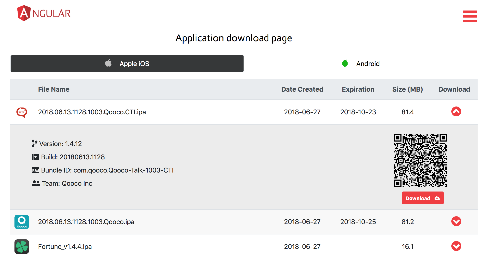
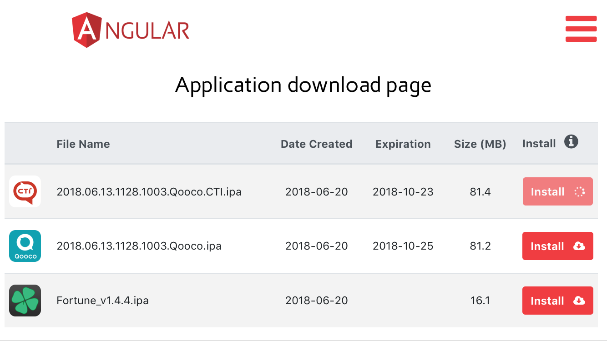

# Beta-distribution page for mobile apps 

Automatically discovers new .ipa/.apk files in configured directories, extracts metadata info and icons. Apps can be installed by scanning QR codes on mobile or by opening page in mobile browser.

Supports installation of ad-hoc/in-house distributed ios apps (see screenshot below)

Mobile platform is auto-detected, so only apps for current platform are shown, e.g android phone screenshot:

Demo page is available [here](http://qooco-apps.herokuapp.com/) 
