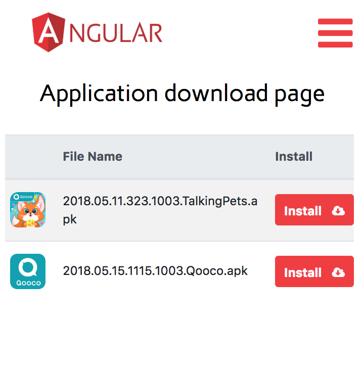

# Beta-distribution page for mobile apps 

Automatically discovers new .ipa/.apk files in configured directories, extract metadata info and icons

Supports installation of ad-hoc/in-house distributed ios apps (see screenshot below)

Mobile platform is auto-detected, so only apps for current platform are shown, e.g android phone screenshot:

Demo page is available [here](http://qooco-apps.herokuapp.com/) 
